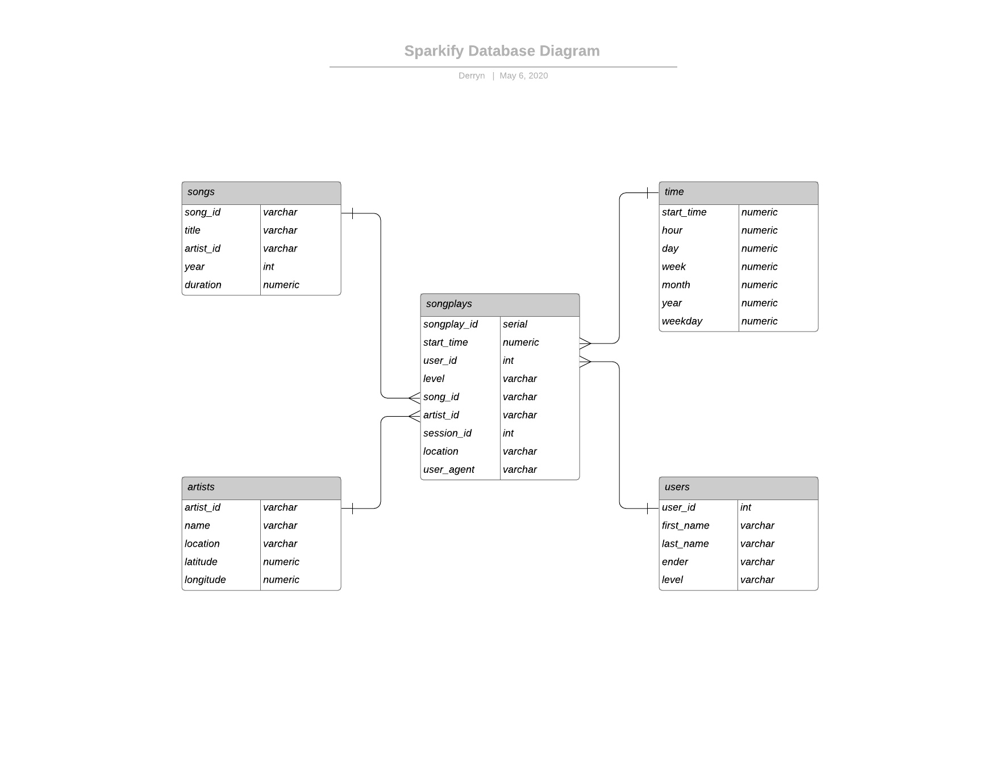

# Udacity Data Engineer Nanodegree | Data Modeling with Postgres

This is the first Udacity Project for the Data Engineer Nanodegree.
We model the data based on the Star Schema design and use a subset of a music dataset.

## Purpose

Put into practice the content learned throughout Lesson 1 of Data Modeling with Postgres.
In this scenario we will be using python to do all the work for us, in order to create a Star Schema
design for a database we will be calling Sparkify (music store). We will also be setting up an ETL pipeline
to populate our database.

## Requirements

- Python 3
- Postgres
- Database named sparkifydb

## Data Model



## Running

- Create new virtual environment `python3 -m venv ~/.sparkify`
- Install required packages `pip3 install -r requirements.txt`
- Make sure to have `sparkifydb` created in Postgres with proper user `user`
- Run `python3 create_tables.py` to create tables
- Run `python3 etl.py` to upload all the data
- Use `test.ipynb` to run tests against the tables with `jupyter notebook test.ipynb`


## Code Structure

### etl.py
ETL Pipeline to process all data files and insert them into tables.

### etl.ipynb
Interactive way to upload data with a single file to test the ETL pipeline.

### sql_queries.py
Contains all the SQL queries to be used in the ETL pipeline. Imported by etl.py and etl.ipynb

### create_tables.py
Drops tables if they exist, creates new ones.

### test.ipynb
Jupyter notebook to test the created tables.

```
Project
|    create_tables.py  
|    etl.py  
|    sql_queries.py  
|    test.ipynb  
|    etl.ipynb
|____data/  
    |
    |____log_data/  
    |    |____2018/  
    |        |____11/  
    |            {log data set .json}  
    |
    |____song_data/  
        |____A/  
            |____A/  
            |    |____A/  
            |    |    {song data set.json}  
            |    |____B/  
            |    |    {song data set.json}  
            |    |____C/  
            |    |    {song data set.json}  
            |
            |____B/  
                |____A/  
                |    {song data set.json}  
                |____B/  
                |    {song data set.json}  
                |____C/  
                |    {song data set.json}  
```